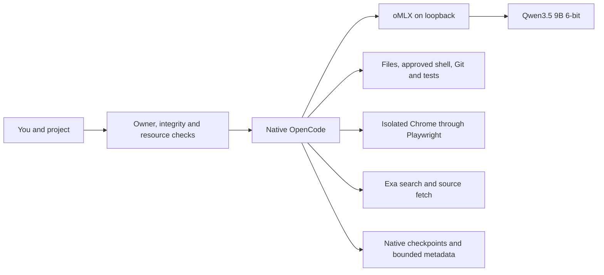
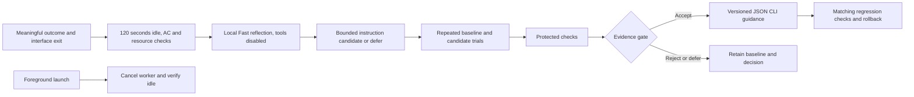

# KRYN

**NOT READY for the complete requested release.** Private installation, update and rollback work on the tested Mac. Sustained workflows, final artifact acceptance and automatic improvement remain incomplete. The selected local model has serious recorded reasoning and coding failures. Frontier parity, general quality gains and beneficial learning have not been demonstrated.

KRYN joins existing tools: OpenCode supplies the interface, agent loop, file/shell tools, plans, checkpoints and subagents; oMLX runs the local model. KRYN adds reproducible configuration, owner access, integrity/resource checks, bounded metadata and an experimental learning worker. It is an installation and reliability layer, not a new model or harness.

## Daily use

After installation and qualification:

```sh
cd /path/to/your/project
~/.local/bin/kryn
```

Use `kryn` when `~/.local/bin` is on PATH. It verifies the owned installation and owner session, starts or verifies oMLX, checks routing, then opens native OpenCode in **Build / Think**. No model account or API key is needed. Describe observable acceptance criteria, approve appropriate tool requests, and inspect the diff and actual test output.

**Ctrl+X, A** opens the agent picker; **Ctrl+P** opens commands. Plan/Fast inspects and discusses; Build/Think edits and tests; Reviewer/Think reads with mutation routes denied. `/review`, `/audit`, `/research`, `/deliver` and `/handoff` supply instructions, not guaranteed outcomes.

For browser verification, let Build settle, use `/agents` to choose **Browse in the same session**, confirm Fast, and provide the local URL and checks. Return to Build for fixes. Browse is primary-only: automatic Build-to-Browse delegation is not configured. This explicit switch keeps browser schemas out of coding turns. A remembered native variant can override the default; **Ctrl+T** cycles variants.

| Command | Purpose |
|---|---|
| `kryn login` / `logout` | Refresh/remove the owner session; logout preserves GitHub CLI login. |
| `kryn doctor` / `doctor --deep` | Inspect installation/runtime; deep verifies model and browser bytes. No generation. |
| `kryn status` / `stop` | Inspect state or stop only the verified owned, idle runtime. |
| `kryn bench` | Guarded protocol smoke, not a coding benchmark. |
| `kryn improve status` | Worker state, budgets, decisions and qualified scope. |
| `kryn improve pause` / `resume` / `disable` / `enable` | Control future background work. |
| `kryn --json-cli` | New-session opt-in to guidance qualified only for disposable JSON CLI tasks. |
| `kryn update v0.1.0` / `rollback` | Explicit private tagged update or previous owned activation. |

Close the interface normally. The unpinned model unloads after 300 idle seconds; the small server may remain running. Eligible learning starts only after interface exit.

## Architecture and profile



| Component | Configured selection |
|---|---|
| Harness / runtime | OpenCode **2.0.10** ARM64; oMLX **0.6.4**, build **2529** |
| Model | `mlx-community/Qwen3.5-9B-6bit`, revision `76fe4065e622cf34990d3c13ef80ec8531c9a0f7` |
| Context / output | **16,384** total / **4,096** maximum output; one active generation |
| Roles | Build, Reviewer and coding children: Think. Plan, Browse and title: Fast; title capped at **128 tokens**. |
| Decoding | Think: temperature .6, top-p .95. Fast: .7, .8, presence penalty 1.5. Both top-k 20. |
| Memory / cache | **14 GiB** ceiling; **8 GB** SSD prefix cache by model revision; no extra hot cache |
| Acceleration | MTP, DFlash, speculative prefill and experimental KV/prefill options off |
| Browser / search | Playwright MCP **0.0.82**, isolated Chrome; three keyless Exa MCP tools |
| Support | Python **3.13+**; ARM64 Node **22.x ≥22.23**, fallback **22.23.1**; uv fallback **0.11.16** |

The earlier 27B Q5/Q4 candidates failed memory-pressure qualification under ordinary desktop load. Six-bit 9B retains image input, tool calls and a supported thinking toggle with more memory headroom. It is provisionally selected for reliability; it is not established as the best coding model. The tested GLM alternative also failed its entry controls.

Native compaction reserves a 2,048-token buffer/keep setting. With 4,096 output reserved, the nominal input trigger is `16,384 − max(4,096, 2,048) = 12,288`. Instructions, tool schemas, images and history share that space, and estimates affect the trigger. Build exposes ten coding tools; Browse admits 17 browser tools plus search. Prefix caching reduces repeated prefill work, not reasoning errors or context limits.

Retrieval uses native search/read and source fetch; no vector database is installed. Detailed task state stays in native checkpoints and `/handoff`. A small owned tracker records references without overwriting user files. Session guidance stays pinned across resume; 500 saved pins require deliberate archival rather than eviction. Lossless recall and sustained 32K/64K work are unqualified.

## Permissions, privacy and resources

All managed roles/helpers use the pinned loopback model. Native request hooks reject other models or inference destinations, including after configuration refresh; cloud providers are disabled. This covers managed inference routing, not all host networking. Search queries and visited sites leave the Mac. Exa is quota-limited and has no guaranteed free availability. Local inference has no metered API charge but consumes finite hardware, electricity, storage and time.

Shell normally asks permission. Reviewer/Explore have native permissions plus mutation guards. One foreground child per parent is admitted; no background swarm. Chrome is isolated, with page WebMCP and unsafe browser code disabled. Project instructions and native skills remain supported; unrelated global catalogs are excluded.

Foreground shell descendants have a project/owned-state write boundary. Native file tools, MCP, formatters, persistent PTYs, reads and networking are outside it; foreground project configuration is trusted. Arbitrary hostile repositories are not safely contained. Background evaluation uses a separate whole-process sandbox, disposable workspace, protected grader and restricted inference relay.

The resource guard requires three normal memory samples, then samples every two seconds. Two warnings, critical pressure, telemetry loss, runtime identity drift or over 512 MiB additional swap cancel owned inference. Any warning fails acceptance. The memory ceiling is not a reservation; samples can miss brief peaks.

## Experimental automatic improvement



**The first real automatic attempt failed during native CLI startup before any model call.** It consumed 5.542 seconds, recorded `defer / reflection_incomplete`, stopped safely and was paused. No candidate, paired learning trial or active-worker preemption was completed. A source correction reached one fake local relay request and denied four protected reads; it made no real model call. Installation and the full live cycle remain unqualified.

Revised source policy `learning-2026-09-20.3` has no always-on daemon: after exit and 120 seconds idle, a finite worker allows two candidate attempts within 600 seconds/day, queue length two, reflection at most 120 seconds/768 tokens and trials at most 360 seconds. The increase follows the preserved zero-dispatch failure; spent history remains. Admission reserves an attempt before dispatch and releases it only with durable proof of zero dispatch and time accounting. Evaluation can span days. Foreground admission targets ten-second cancellation and fails closed after thirty seconds if safe yield is unconfirmed; active-preemption timing remains unmeasured.

Candidates are at most 1,500 characters of instructions for **disposable JSON CLI tasks**. They cannot change code, tools, permissions, credentials, routing or evaluation. Three repeats across three families in both arms, then three protected checks, require 21 runs. Promotion requires no lost baseline passes, all candidate cases passing, and at least two paired correctness wins or 15% median efficiency gain with matched caches. Shared caches currently prevent an efficiency-only claim; protected-suite reuse is capped.

Ordinary projects receive no narrow learned instructions. Only `--json-cli` new sessions opt in; resumed sessions retain their pin. Regression monitoring requires matching scoped outcomes. Rejection/deferral is valid; useful promotion is not forced or demonstrated.

Observations contain enums, hashes, counts and timings—not prompts, code, commands, URLs or project paths. Unknown correctness stays unknown. Owned metadata/trackers retain at most 30 days/500 records; evaluation traces retain seven days/256 MiB. Native conversation history is separate and may contain private content.

## Private installation and lifecycle

**This flow was exercised against actual private DRAFT assets from an external directory with spaces and a minimal environment, without a source checkout. Final publication remains pending.** Requirements: native Apple Silicon, macOS 26/27, at least 48 GiB memory, GitHub CLI, bootstrap `python3`, and Chrome. Only the M4 Max 40-GPU-core/48-GiB Mac on macOS 26.6.2 build 25G83 has measurements; other hosts and macOS 27 are unqualified.

Sign in using the browser flow and macOS Keychain, then download and verify:

```sh
gh auth login --hostname github.com --web
(
  set -eu
  kryn_stage="$(mktemp -d "${TMPDIR:-/tmp}/kryn-install.XXXXXX")"
  cd "$kryn_stage"
  gh release download v0.1.0 --repo PranavMishra28/kryn \
    --pattern install-kryn.py --pattern '*.whl' --pattern SHA256SUMS
  shasum -a 256 -c SHA256SUMS
  python3 install-kryn.py --tag v0.1.0
)
```

The bootstrap verifies private-repository access, active Keychain credentials and stable owner ID **90290458** before its wheel download. Token environment variables and plaintext GitHub token storage are rejected. Only verified identity is cached for **seven days** offline; expiration requires online login. This owner policy does not resist a hostile administrator.

Wheel/bootstrap checksums come from authenticated private GitHub assets and a source-bound manifest. They have no independent signature/notarization; integrity checks do not protect against publisher compromise. Upstream oMLX codesign is verified separately. No public PyPI upload or hosted CI attestation is claimed.

The installer provisions/reuses Python, Node, OpenCode, oMLX, browser dependencies and pinned model files. The 9B download measured 8.22 GB; missing bytes plus a 40 GiB reserve must fit. Dependencies/weights download separately. Existing components require integrity verification; changed/unowned files are preserved.

Install/update holds the foreground lease, verifies runtime identity and idle counters, waits for port closure before runtime-setting changes, stages verified files and records a recoverable transaction. Rollback restores matching owned settings/aliases and the previous activation while preserving new dependencies, weights and user changes. Updates require an explicit tag; identical-package reinstalls still verify dependencies/models. Real update/rollback/re-update passed. Eleven shipped-wheel fault controls passed, including SIGKILL at four activation boundaries and fresh-process recovery preserving bytes, modes and absence. Runtime, dependency and deployment boundaries were mocked; full live interrupted installation and power loss remain unqualified.

Owned state lives under `~/Library/Application Support/LocalAI`, settings under `~/.omlx`, the app under `~/Applications/oMLX.app`, aliases under `~/.local/bin`. There is no automatic uninstaller. Preserve sessions/backups, disable improvement, stop the verified idle runtime, then remove only verified owned files while preserving shared settings and unrelated applications/models.

## Evidence and limits

[RESULTS.json](RESULTS.json) contains attempts, failures, scope and pending gates; [RELEASE_MANIFEST.json](RELEASE_MANIFEST.json) binds known source, dependency, profile and artifact hashes. Raw private traces are excluded. Historical readiness claims do not apply to this candidate.

**Runtime/protocol:** five isolated 9B cold starts passed; median 3.731 seconds to a tiny completed answer, with filesystem caches retained. Revised 4,097-token cache cases observed cached-token counts **0 → 4,096 → 0 after edit → 4,096 after restoration → 4,096 after runtime restart**. Six residual protocol checks passed: two normalized tool counts, synthetic fact retention at 12,288 input tokens, rejection at 16,448, cancellation after output began, and recovery. These do not qualify native automatic-compaction retention, live corrupt-cache recovery or long-run stability. Earlier cache-eligibility and token-count failures remain recorded; corrected probes do not relabel them.

**Quality:** the fixed API calibration scored **0/6 Fast** semantic checks and **0/6 Think** within its 30-second deadline; both used temperature .6, unlike production Fast .7. One earlier supervised Fast TUI task passed 22 model-written tests and 12 independent checks after eight failed tools, taking 1,372.496 seconds including approvals/execution. Its title-token waste was fixed. The tested GLM artifact/runtime pairing produced degenerate output in Fast and Think despite normal sampled pressure; it was rejected without a broader model-quality judgment.

The corrected Think .6 coding pair matched initial files, budget, model, sampler and ten tool names; complete schemas differ. Stock ran first with shared caches:

| Initial result | Stock OpenCode | KRYN |
|---|---:|---:|
| Independent checks | 17/18 | 17/18 |
| Task complete | No; timeout | No; timeout |
| Driver time with cleanup | 369.455 s | 367.765 s |
| Tool calls / native error-state tools | 47 / 14 | 37 / 1 |
| Completed shells with nonzero exit | 5 | 6 |
| Compactions | 3 | 4 |
| Reported output tokens | 13,085 | 12,683 |

Both failed model-written public tests, with normal sampled pressure and zero additional swap. Each has an interrupted generation without token counters. Stock’s wrong paths appeared in generated compaction; no wrapper path defect was observed. This pair establishes neither a correctness advantage nor general quality/latency gain. Earlier Think1.0, unscoped 44-tool baseline and invalid outer-sandbox grading attempts remain distinguished in the results.

The same KRYN session then ended normally after a 1,320.481-second continuation: 127 tools, four edit errors, 23 completed compactions and 48,421 reported output tokens. All 631 resource samples were normal, with zero additional swap. Protected checks passed **26/27**; its public suite still failed, despite the final answer claiming 13 tests passed. The requested fresh reviewer and handoff were omitted. Native completion therefore did not meet full task acceptance. There was no stock continuation or operator code fix.

**Distribution/lifecycle:** clean private draft installation, update, rollback and re-update passed on this existing Mac. The current installed draft is `1126b0ce…6d5602bf`, client `f00700bc09fd4a77`, Think .6. An actual daily-launcher outage/relaunch passed on the prior client with unchanged launcher/guard code; final-artifact dogfood remains pending. It observed an active request, not a pre-stop streamed-token boundary or complete network audit. Prior partial attempts remain preserved.

Outstanding acceptance includes successful sustained coding/browser/review, handoff, final artifact dogfood/publication, full live interrupted installation, complete learning and active preemption. Offline checks establish specific properties, not agent correctness. Infinite inference, frontier parity, general self-improvement, integrated macOS computer control, office suites and image generation are not implemented or demonstrated. See [evaluation methodology](evals/README.md), [profile](setup/accepted-profile.json) and [third-party notices](THIRD_PARTY_NOTICES.md).
