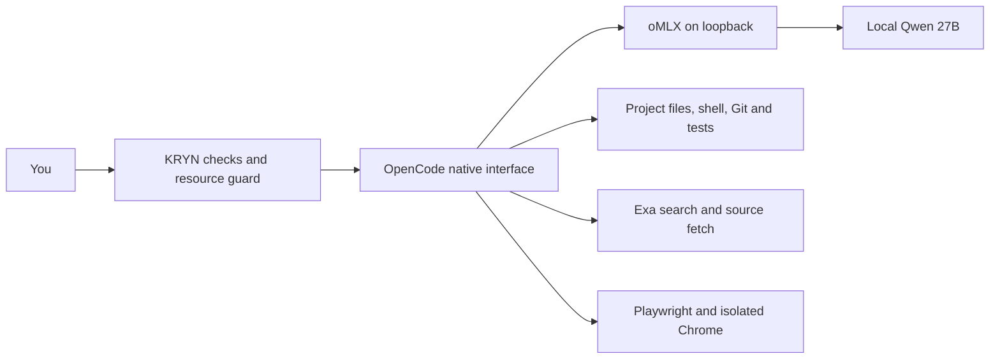
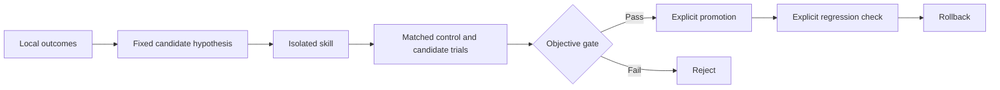

# KRYN

**Daily coding: ready with explicit limitations on this Mac.** The installed Q4 profile completed coding, tests, browser/search/image use and a cold restart through the actual application. No further installation is needed here. Work remains supervised: permission approvals and occasional follow-ups are required.

**Full original release: incomplete.** Autonomous improvement, sustained 32K work and a completed MTP comparison remain unqualified. These mandatory requirements are preserved in the machine-readable release status; daily readiness does not turn them into passes.

## Start coding

On the configured Mac:

```sh
cd /path/to/your/project
~/.local/bin/kryn
```

If your PATH includes `~/.local/bin`, use `kryn`. It checks the installation, starts the owned oMLX runtime, verifies local routing and tools, and opens OpenCode in **Build** mode. Enter a task, review permission requests, and let it edit and run tests. No model account or API key is required.

Use **Ctrl+X, A** to select a native agent, or Shift+Tab to cycle. **Plan** inspects and discusses; **Build** edits and tests; **Reviewer** has edit/shell/execute permissions denied; **Browse** exposes browser and research tools. Use **Ctrl+P** for native commands. `/review`, `/audit`, `/research` and `/handoff` are configured shortcuts. Native sessions, project instructions, skills, Git and supported undo remain OpenCode features.

Work in bounded milestones and inspect the diff and actual test results. Supply the raw diff when asking Reviewer to assess a change; it cannot run Git commands. The default Fast variant disables thinking; Low, Medium and Xhigh request reasoning-effort hints, not guaranteed compute budgets. `/review` uses Xhigh and can take longer. A handoff saves useful task state; compaction is not perfect memory.

Close the native interface normally when finished. oMLX unloads an idle, unpinned model after five minutes; its small server can remain running. `kryn stop` stops the verified owned, idle runtime. This does not target existing Ollama or personal applications.

| Command | Purpose |
|---|---|
| `kryn init` | Verify the existing installation without overwriting it. |
| `kryn doctor` | Check exact release/profile, dependencies, runtime and MCP readiness; no generation. |
| `kryn doctor --deep` | Also rehash every pinned model file. |
| `kryn status` | Show runtime and improvement state; a stopped runtime is unavailable. |
| `kryn stop` | Stop the owned, idle oMLX server. |
| `kryn bench` | Run real, guarded model protocol smoke; this is not a coding-quality benchmark. |
| `kryn improve status` | Inspect local outcomes and improvement controls. |

## What is installed



KRYN is a launcher and configuration layer, not a new agent loop, TUI or tool proxy.

| Component | Exact selection |
|---|---|
| Harness | OpenCode 2.0.10 ARM64 |
| Runtime | oMLX 0.6.4, app build 2529 |
| Model | `gcoli/Qwen3.8-27B-oQ4e-mtp` |
| Model revision | `c41ed507f1b16320942a1e9ce340e71d2692dee2` |
| Context / output | 16,384 context; at most 4,096 output tokens |
| Default | Build / Fast; one generation at a time |
| Memory and cache | 24 GiB runtime ceiling; 8 GiB SSD prefix cache; no extra hot cache |
| Compaction | Native automatic compaction; 2,048-token buffer and keep setting |
| Idle unload / MTP | 300 seconds; MTP off |
| Browser | Playwright MCP 0.0.82; pinned Playwright dependency; isolated Chrome |
| Search | Exa keyless remote MCP: search, advanced search and fetch |
| Node | 22.23.1 ARM64 |

This keeps the same 27B base model and reduces weight precision to obtain memory headroom. Its 16 pinned files total 15.828 GiB. Q4 quality equivalence to Q5 is not assumed. Q5 repeatedly failed this Mac's memory guard, including after foreground apps were reduced. A usable measured profile takes priority over a larger setting that cannot complete work.

The configured context is not a promise of unlimited history or sustained long-context quality. Images, tool schemas and helper prompts also consume context and memory. **32K/64K sustained work, MTP acceleration and frontier parity are not qualified.** MTP remains off because the earlier OFF arm failed before an ON comparison was admitted.

## Installation on another Mac

The tested host is an M4 Max with 40 GPU cores and 48 GiB unified memory, macOS 26.6.2 build 25G83. Other hardware is unqualified. Fresh installation requires native Apple Silicon, macOS 26/27, at least 48 GiB memory and 140 GiB free disk, plus Python 3.13+, ARM64 Node 22.23.1 with adjacent npm, uv, Git and Google Chrome. Tested Chrome: 153.0.8010.53.

```sh
git clone https://github.com/PranavMishra28/kryn.git
cd kryn
./bootstrap
./bootstrap --apply
```

The private repository requires access. The first bootstrap checks prerequisites and may record compact owned metadata. `--apply` downloads and verifies the pinned stack. Set `KRYN_PYTHON` if needed; `--node` and `--uv` select existing installations. Applications, model weights and browser profiles are not bundled. macOS may require first-open approval on another machine.

The already configured Mac needs no bootstrap rerun. Existing modified configurations are deliberately preserved; bootstrap is not a general migration tool. Large verified downloads are cached. Disposable installer tests passed; a complete second-machine install has not been demonstrated. The current Mac retains prior models/backups and falls below the fresh-install disk threshold; the working installation only requires its normal runtime headroom.

Offline checks:

```sh
python3.13 -E -B -m unittest discover -s setup -p 'test_*.py'
python3.13 -E -B tools/localai.py --self-check
python3.13 -E -B evals/bench.py verify
```

## Resource and privacy boundaries

The unchanged guard requires three normal memory samples before inference, samples every two seconds, and cancels after two warnings, critical pressure, missing telemetry, runtime identity drift or more than 512 MiB additional swap. Any warning fails evaluation acceptance. It interrupts owned work, cleans up its client and verifies runtime idle. Do not disable it to force a task through. The 24 GiB ceiling is not a system-wide memory reservation; other applications affect available headroom.

Inference is restricted to the configured loopback model, with cloud providers disabled and effective routing checked. There are no metered model API calls. Local work still consumes electricity, hardware, storage and time; throughput is finite. Search and websites are online, quota-limited services. Queries leave the Mac: keep private task content out of public search.

Browser tools use an isolated Chrome session, not a personal profile. Page-provided WebMCP and unsafe browser code are disabled. Ordinary shell descendants have a project/owned-state write boundary. Native file tools, MCP, formatters, persistent PTYs, reads and networking are outside that boundary. This is not a complete hostile-project sandbox; project configuration is trusted and can redefine native behavior.

Project `AGENTS.md`, native `.opencode/skills` and explicit `.agents/skills`/`.claude/skills` paths remain supported. Unrelated global skill catalogs are excluded to avoid overwhelming context. Explicit native plan files may use `~/.opencode/plan`.

## Improvement: available controls, no autonomous learning

Compact local outcomes record enums, counts, timings and release/profile hashes, without prompts, source, credentials, URLs or project paths. A normal interface exit records **unverified**, not task success. On each write, owned records older than 30 days or beyond the newest 500 are pruned; unknown files are preserved. Native sessions can contain private prompts and code and remain local as user work. Raw evaluation traces stay local and are excluded from distribution.



`kryn improve observe` inspects repeated failures; `propose`, `register`, `evaluate`, `promote`, `monitor`, `reject` and `rollback` provide operator controls. Use `kryn improve --help` and the frozen [evaluation guide](evals/README.md). Promotion reruns objective checks and requires matched development, validation and hidden cases; caller-written PASS records cannot activate a skill. The fixed skill is the only optimization artifact: credentials, permissions, routing and external-action authorization are excluded.

Deterministic fixtures verify isolation, rejection, promotion gates and rollback. Foreground and improvement work share an exclusive lease; they refuse overlap rather than preempting each other. **No skill is active. Autonomous reflection, automatic trial dispatch, continuous regression monitoring and live learning benefit are not implemented or qualified.** There is no root daemon or automatic model downloader.

## Verification and remaining limits

The installed Q4 application completed a three-file coding change and added 18 focused tests. All 20 project tests and all three frozen independent checks passed; original tests/data stayed unchanged. The coding and completion-follow-up stage took 857 seconds, used 36 tool calls and two automatic compactions, and stayed at normal memory pressure with zero additional swap and a sampled runtime peak of 20.67 GiB.

This was **supervised coding**: the model repaired two wrong expectations in its own new tests and an edit mismatch. After the second compaction it repeated completed exploration. An operator input coincided with a permission dialog and declined a redundant diff request, interrupting that turn; a completion follow-up then produced the correct final handoff. Six ordinary shell requests were approved. These observations do not qualify unattended long-running work.

The previous release's **NOT READY** result and all recorded failures remain in [RESULTS.json](RESULTS.json) and Git history. Earlier Q5 trials included 28 project tests, 10 turns / 45 tool calls and scoped mobile browser recovery, but also cold-load and sustained desktop memory stops. Historical measurements are not Q4 results.

A fresh native Reviewer/Xhigh session finished with all project file hashes unchanged. It required the raw diff as a follow-up, took 559 seconds and made one false claim about repeated query parameters; a live HTTP check disproved that claim. Review is supplementary to actual tests. The installed deep doctor rehashed all 16 model files and verified both MCP services in 14.312 seconds.

The unchanged launcher previously passed controlled local-outage refusal, autostart/UI recovery, routing checks and cleanup. The Q4 profile now passed all eight cold-start protocol checks in 33.584 seconds: health, model identity, Fast/Low/Medium/Xhigh streams and two-step tool replay. A subsequent actual `kryn` launch reopened native session history in Build/Fast with both MCP services connected. Normal exit removed all ten owned client/browser processes from the earlier session, and the disposable app server was stopped. Offline source checks pass 97 tests. Independent source review found no remaining blockers after migration verification was placed inside rollback handling.

Across 43.6 minutes of observation covering these workflows, all 1,225 pressure samples were normal, additional swap stayed at zero and the sampled runtime peak was 21.18 GiB. Sampling may miss short peaks; this does not qualify every project or foreground workload.

A fresh Browse/Fast session navigated the disposable app, filtered its table, inspected the console, saved and opened a screenshot, and made one public search that returned the official Python unittest documentation. The screenshot independently showed the correct two rows, and source/data stayed unchanged. This took 667.562 seconds, eight tool calls, four ordinary permission approvals and five compactions, without a completion follow-up. This single desktop workflow does not qualify sustained browser use, narrow layouts, error recovery or general vision accuracy.

Browse exposes a larger tool description set (11,694 prompt tokens on its first request here); at 16K it compacted frequently, adding substantial latency. Optional macOS computer control, office modules and local image generation are not installed or qualified. No configuration provides infinite compute or guarantees frontier-level results.

## Updating, rollback and uninstall

No automatic update command is provided. Pin one change, preserve the previous release, verify artifacts, and rerun relevant checks before adoption. Existing customized installations require an explicit reviewed migration.

Owned state is under `~/Library/Application Support/LocalAI`; runtime settings are in `~/.omlx`; the app is `~/Applications/oMLX.app`; aliases are `~/.local/bin/kryn` and `~/.local/bin/localai`. Content-addressed clients and private pre-change backups remain under `LocalAI/client` and `LocalAI/backups`. The Q4 migration backs up the prior configuration, settings and launchers in `backups/daily-coding-q4-20260920`. Prior Q5 weights remain separately in `challenger/models`.

Rollback requires the runtime stopped and restoration of the exact backed-up owned bytes and modes, after checking the current installation still matches the release being replaced. Preserve changed user files, model weights and sessions unless removal is intended.

To uninstall, finish foreground work, run `kryn stop`, quit the owned app, and verify its listener/process are gone. Preserve useful work and backups, then remove only verified KRYN-owned app/state and unchanged aliases. Inspect shared settings and support entries before deletion. Preserve existing Ollama, Intel OpenCode, personal profiles and unrelated configuration; never sweep shared support or temporary directories.

The [release manifest](RELEASE_MANIFEST.json) binds exact source/profile/dependency/evaluation versions. [Third-party notices](THIRD_PARTY_NOTICES.md) preserve component licensing. Sanitized results contain evidence hashes; private traces remain on the original Mac. Model weights, credentials, personal paths, caches and browser profiles are excluded from the private source package.
