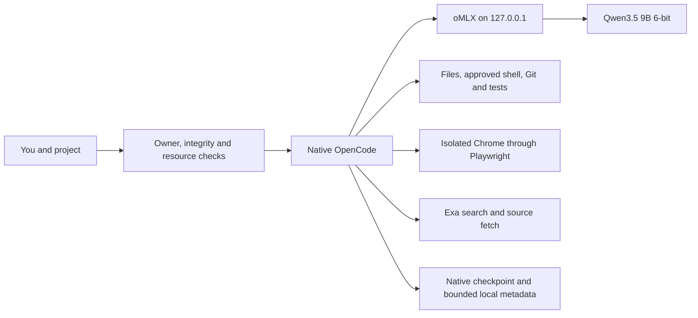
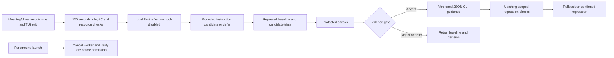

# KRYN

**NOT READY for the complete requested release.** A private 0.1.0 candidate is installed on the development Mac. The final released wheel, sustained native coding workflows and complete automatic improvement cycle still need qualification. The current 9B model passes scoped runtime checks but has serious recorded reasoning failures. There is no demonstrated frontier parity or measured general learning benefit.

KRYN packages OpenCode, a local model and the surrounding installation, resource, permission and evaluation controls into one command. OpenCode supplies the interface, agent loop, file/shell tools, sessions, plans, checkpoints and subagents. KRYN adds reproducible configuration, owner access, guarded lifecycle, bounded outcome tracking and a small experimental learning worker. Convenience and reliability controls are implemented; better coding quality remains a claim to test.

## Daily use

After a release is installed and qualified:

```sh
cd /path/to/your/project
~/.local/bin/kryn
```

Use `kryn` when `~/.local/bin` is on PATH. It checks the owned installation and owner session, starts or verifies oMLX, checks local routing and tools, then opens native OpenCode in **Build / Think**. Enter a task with observable acceptance criteria and review permission requests. No model account or model API key is needed.

For example, “add CSV export and test invalid dates” goes through the local model, native file edits and approved shell tests. The agent reports results; inspect the diff and actual test output. Native completion alone never proves correctness. Use **Ctrl+X, A** to choose an agent and **Ctrl+P** for commands. Plan/Fast inspects and discusses; Build/Think edits and tests; Reviewer/Think reads with mutation routes denied; Browse/Fast exposes web and browser tools. `/review`, `/audit`, `/research`, `/deliver` and `/handoff` are supplied instructions, not guarantees that the model follows every step.

| Command | Behavior |
|---|---|
| `kryn login` / `kryn logout` | Refresh or remove the KRYN owner session. Logout preserves GitHub CLI login. |
| `kryn doctor` / `kryn doctor --deep` | Check installed configuration/dependencies/runtime; deep also verifies model and browser bytes. No model generation. |
| `kryn status` / `kryn stop` | Inspect state or stop only the verified owned, idle runtime. |
| `kryn bench` | Run guarded protocol smoke, not a coding benchmark. |
| `kryn improve status` | Show worker state, budgets, decisions and qualified scope. |
| `kryn improve pause` / `resume` / `disable` / `enable` | Control future background work. |
| `kryn --json-cli` | Opt a **new** native session into guidance qualified only for disposable JSON command-line programs. Ordinary projects use the baseline. |
| `kryn update v0.1.0` / `kryn rollback` | Explicit private tagged update or restore the previous owned activation. |

Close the interface normally when finished. The configured unpinned model unloads after 300 idle seconds; the small server can remain running. Learning, when eligible, starts only after the interface closes.

## Architecture and selected profile



| Component | Current source configuration |
|---|---|
| Harness / runtime | OpenCode **2.0.10** ARM64; oMLX **0.6.4**, app build **2529** |
| Model | `mlx-community/Qwen3.5-9B-6bit` at `76fe4065e622cf34990d3c13ef80ec8531c9a0f7` |
| Context / generation | **16,384** total tokens; **4,096** maximum output; one active generation |
| Roles | Build, Reviewer and coding children: Think. Plan, Browse and title: Fast. Title alone has a **128-token** output bound. |
| Runtime memory / cache | **14 GiB** ceiling; **8 GB** SSD prefix-cache cap; no extra hot cache; cache isolated by model revision |
| Decoding | Think: temperature 1, top-p .95. Fast: .7, .8, presence penalty 1.5. Both top-k 20. |
| Acceleration | MTP, DFlash, speculative prefill and experimental KV/prefill options off |
| Browser / search | Playwright MCP **0.0.82** with isolated installed Chrome; three Exa keyless remote MCP tools |
| Support runtimes | Python **3.13+**; compatible ARM64 Node **22.x ≥22.23**, verified fallback **22.23.1**; uv fallback **0.11.16** |

Qwen3.8-27B Q5 and then Q4 failed memory-pressure qualification under ordinary desktop load. Historical Q4 successes are retained, but do not erase later cold-load failures. The smaller six-bit 9B candidate retains image input, tool calling and the supported `enable_thinking` toggle with substantially more memory headroom. It is provisionally selected for reliability, not established as the best coding model. Other researched alternatives remain unqualified; upstream benchmark claims are not measurements of this installation.

**Context is finite.** Native compaction uses a 2,048-token buffer and keep setting. With the current 4,096 output reservation, its nominal trigger is `16,384 − max(4,096, 2,048) = 12,288` input tokens. System instructions, tool schemas, images and history all compete for that space. Counting starts with estimates; this is not 12,288 tokens of usable conversation. Build excludes browser/search schemas; Browse admits 17 relevant browser tools plus search. SSD prefix caching reduces repeated prefill work, not context limits or reasoning errors.

Retrieval uses native file search/read and online source fetch; no vector database is installed. A small owned tracker records milestone/checkpoint references. Detailed task state remains in native checkpoints and `/handoff`; it never overwrites a user task file. Session guidance is immutable across resume. Saved pins are capped at 500 without eviction; reaching that cap requires deliberate archival. Sustained 32K/64K work and lossless recall are unqualified.

## Permissions, privacy and resources

All managed agents, helpers and compaction use the pinned loopback model. Native request hooks reject another model or inference destination, including after configuration refresh. Cloud providers are disabled. This is a managed inference-routing guarantee, not a host-wide network firewall: search queries and visited websites leave the Mac. Exa's free endpoint has quotas and no guaranteed availability. Local inference has no metered API charge but consumes finite hardware, electricity, storage and time.

Shell execution normally asks permission. Reviewer/Explore use native permissions plus tool guards to deny mutation routes; one foreground child per parent is admitted, without background subagent swarms. Chrome uses an isolated session, with page WebMCP and unsafe browser code disabled. Project `AGENTS.md`, native skills and explicit `.agents/skills` / `.claude/skills` remain supported; unrelated global catalogs are excluded.

Ordinary foreground shell descendants have a project/owned-state write boundary. Native file tools, MCP, formatters, persistent PTYs, reads and networking are outside that shell boundary. Foreground project configuration is trusted. This is not safe execution of an arbitrary hostile repository. The background evaluator has a separate whole-process sandbox, disposable workspace and restricted inference relay.

The resource guard requires three normal memory samples, then samples every two seconds. Two warnings, critical pressure, telemetry loss, runtime identity drift or over 512 MiB additional swap cancel owned inference. Any warning fails evaluation acceptance. The 14 GiB ceiling is not a reservation against other applications, and samples can miss brief peaks.

## Bounded automatic improvement



Policy `learning-2026-09-20.2` is implemented but the complete live cycle is **unqualified**. There is no always-on daemon or learning while the interface is open. Eligible local outcomes can launch a finite worker after exit and 120 seconds idle. Limits are one candidate and 600 seconds of work per day, queue length two, reflection at most 120 seconds/768 output tokens, and each trial at most 360 seconds. The budget can spread an evaluation across days. Foreground admission requests cancellation, targets ten seconds and fails closed if safe yield cannot be confirmed within thirty seconds; that live timing remains to be measured.

The only candidate artifact is at most 1,500 characters of instructions for **disposable JSON CLI tasks**. It cannot change code, tools, permissions, credentials, routing or its evaluator. Trials reuse native OpenCode, with identical session pinning for baseline and candidate. Selection runs three repeats across three task families, both arms, followed by three protected checks: 21 runs. Promotion requires no lost baseline passes, all candidate cases passing, and at least two paired correctness wins or a 15% median efficiency gain with matched caches. Shared-cache conditions currently cannot support an efficiency-only claim. Protected-suite reuse is capped. A valid rejection or deferral is an outcome; promotion is not forced.

Ordinary project sessions receive no narrow learned instructions. Only `--json-cli` new sessions opt into that scope; resumed sessions keep their previous pin. Regression monitoring requires matching scoped outcomes. No measured general improvement or accepted beneficial candidate is claimed.

Learning observations contain enums, hashes, counts and timings, not raw prompts, source, commands, URLs or project paths. Unknown correctness/corrections stay unknown. Owned metadata and trackers retain at most 30 days/500 records; owned evaluation traces retain seven days/256 MiB. Native user conversation history is separate and can contain private code and prompts.

## Private installation and lifecycle

**The following v0.1.0 release command is pending final asset publication and validation. Do not treat it as a completed release gate.** No source checkout or public PyPI upload is required. Prerequisites are native Apple Silicon, macOS 26/27, at least 48 GiB memory, GitHub CLI, a bootstrap `python3`, and Google Chrome. Only the M4 Max 40-GPU-core/48-GiB Mac on macOS 26.6.2 build 25G83 has recorded measurements; other hosts and macOS 27 are unqualified.

Sign into GitHub CLI using its browser flow and macOS Keychain:

```sh
gh auth login --hostname github.com --web
```

Then download and verify the complete private asset set before executing the installer:

```sh
(
  set -eu
  kryn_stage="$(mktemp -d "${TMPDIR:-/tmp}/kryn-install.XXXXXX")"
  cd "$kryn_stage"
  gh release download v0.1.0 --repo PranavMishra28/kryn \
    --pattern install-kryn.py --pattern '*.whl' --pattern SHA256SUMS
  shasum -a 256 -c SHA256SUMS
  python3 install-kryn.py --tag v0.1.0
)
```

The bootstrap verifies the private repository, active Keychain credential and stable owner ID **90290458** before its wheel download. Token environment variables and plaintext GitHub token storage are rejected. KRYN caches only verified identity for **seven days** of offline use; expired sessions need online login. This is an owner access policy, not protection against a hostile administrator. Offline inference works while authorized; online search does not.

The installer provisions/reuses managed Python, Node, OpenCode, oMLX, browser dependencies and pinned model files. The 9B download measured 8.22 GB; time depends on bandwidth. Missing model bytes plus a 40 GiB disk reserve must fit. Dependencies/models are separately downloaded, not bundled in the wheel. Existing components are adopted only after integrity verification; changed or unowned files are preserved and can require manual resolution.

Install/update holds the foreground lease, checks the current runtime identity and idle counters, waits for its port to close before changing runtime settings, stages verified files, and records a recoverable activation transaction. Configuration, aliases and the previous activation are backed up. Failure or `kryn rollback` restores owned settings when their current hashes still match; it preserves new dependencies, weights and changed user files. Updates require an explicit tag; there is no unattended updater. Matching-package reinstalls still verify dependency/model integrity.

Owned state is under `~/Library/Application Support/LocalAI`, runtime settings under `~/.omlx`, the app under `~/Applications/oMLX.app`, and aliases under `~/.local/bin`. To uninstall, finish work, disable improvement, run `kryn stop`, verify the owned listener has closed, then remove only verified owned files after preserving sessions/backups. There is no automatic uninstaller. Shared settings, personal applications and unrelated models must be inspected and preserved.

## Evidence and current limits

**MEASURED ON THIS MAC:** isolated 9B runtime cold starts passed 5/5, median 3.731 seconds to the first tiny completed response, with disk/filesystem caches retained and personal apps open. Think/tool replay/image smoke and revised cancellation/recovery passed. Peak sampled process footprint was 9.48 GiB, with normal sampled pressure and zero additional swap. These are short runtime checks, not installed product or long-task results.

The structured coding/data calibration used three frozen cases, two repeats, alternating Fast/Think order, a 30-second per-request deadline and retained failures. Fast completed all streams but passed **0/6** strict semantic checks, median 1.898 seconds. Think passed **0/6** within that deadline; all six timed out in reasoning without a final answer. This does not measure unconstrained Think quality. The real native daily task and representative longer tasks remain pending. No matched stock-OpenCode quality uplift, external benchmark score or genuine frontier comparison is established.

**CONFIGURED BUT UNQUALIFIED:** final private wheel installation/restart, sustained native coding/browser/review workflows, complete live learning, foreground preemption timing and beneficial promotion. Offline tests and live sandbox canaries support specific implementation properties, not agent correctness. **UPSTREAM CLAIMS** about model benchmarks or maximum context do not qualify this profile. **NOT IMPLEMENTED:** a new model/harness, infinite inference, general autonomous self-improvement, integrated macOS computer control, office suites or image generation.

The previous Q4/Q5 results and failures remain in [RESULTS.json](RESULTS.json), [RELEASE_MANIFEST.json](RELEASE_MANIFEST.json) and Git history; their old daily-readiness statements do not apply to the current candidate. The final release must replace its current acceptance summary and bind exact source, profile, dependency, suite and artifact hashes. [Evaluation fixtures and methodology](evals/README.md), [current profile](setup/accepted-profile.json) and [third-party notices](THIRD_PARTY_NOTICES.md) are retained. Private traces, credentials, personal paths, model weights, caches and browser profiles are excluded from distribution.
