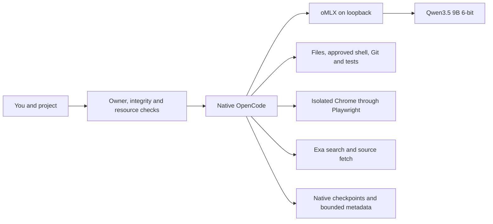
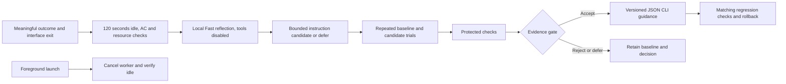

# KRYN

**NOT READY for the complete requested release.** Private installation, update and rollback work on the tested Mac. Required coding, browser, research and review tasks have recorded failures. Final artifact acceptance and automatic improvement remain incomplete. Frontier parity, general quality gains and beneficial learning have not been demonstrated.

KRYN joins existing tools: OpenCode supplies the interface, agent loop, plans, tools, checkpoints and subagents; oMLX runs the local model. KRYN adds reproducible configuration, owner access, integrity/resource checks, bounded metadata and an experimental learning worker.

## Daily use

After installation and qualification:

```sh
cd /path/to/your/project
~/.local/bin/kryn
```

Use `kryn` when `~/.local/bin` is on PATH. It verifies the owned installation and owner session, starts or verifies oMLX, checks routing, then opens native OpenCode in **Build / Think**. No model account or API key is needed. Describe observable acceptance criteria, approve appropriate tools, and inspect the diff and actual test output.

**Ctrl+X, A** opens the agent picker; **Ctrl+P** opens commands. Plan/Fast inspects; Build/Think edits and tests; Reviewer/Think reads with mutation routes denied. `/review`, `/research`, `/deliver` and `/handoff` provide instructions whose successful execution still needs verification.

The `/audit` correction in v7 switches the primary session to **Audit / Think**, permits one fresh foreground Reviewer, and keeps the parent read-only after that child returns and across resume. Explicitly switch back to Build to edit or run checks. Pinned native controls pass with deterministic fake replies; installed local-model workflow and review quality remain unqualified. In the tested v5, `/audit` retained Build: the child stayed read-only, but the parent subsequently changed CSS.

For browser checks, let Build settle, choose Browse through `/agents`, confirm Fast, and provide the local URL and checks. Return to Build for fixes. Browse is primary-only; automatic Build-to-Browse delegation is not configured. The initial live trial needed a fresh Browse session and operator-started disposable server. A remembered variant can override the default; **Ctrl+T** cycles variants.

| Command | Purpose |
|---|---|
| `kryn login` / `logout` | Refresh/remove the owner session; preserve GitHub CLI login. |
| `kryn doctor` / `doctor --deep` | Inspect integrity/runtime; deep verifies model/browser bytes. No generation. |
| `kryn status` / `stop` | Inspect state or stop only the verified owned, idle runtime. |
| `kryn bench` | Guarded protocol smoke, not a coding benchmark. |
| `kryn improve status` | Worker budgets, decisions and qualified scope. |
| `kryn improve pause` / `resume` / `disable` / `enable` | Control future background work. |
| `kryn --json-cli` | Opt new disposable JSON CLI sessions into experimental guidance. |
| `kryn update v0.1.0` / `rollback` | Explicit private tagged update or previous owned activation. |

Close normally. The unpinned model unloads after 300 idle seconds; the small server can remain. Learning is currently paused; eligible future runs start only after interface exit.

## Architecture and profile



| Component | Selection |
|---|---|
| Harness / runtime | OpenCode **2.0.10** ARM64; oMLX **0.6.4**, build **2529** |
| Model | `mlx-community/Qwen3.5-9B-6bit`, revision `76fe4065e622cf34990d3c13ef80ec8531c9a0f7` |
| Context / output | **16,384** total / **4,096** maximum output; one active generation |
| Roles | Build, Reviewer and coding children: Think. Plan, Browse and title: Fast; title capped at **128 tokens**. |
| Decoding | Think: temperature .6, top-p .95. Fast: .7, .8, presence penalty 1.5. Both top-k 20. |
| Memory / cache | **14 GiB** ceiling; **8 GB** SSD prefix cache by model revision; no extra hot cache |
| Acceleration | MTP, DFlash, speculative prefill and experimental KV/prefill options off |
| Browser / search | Playwright MCP **0.0.82**, isolated Chrome; three keyless Exa MCP tools |
| Support | Python **3.13+**; ARM64 Node **22.x ≥22.23**, fallback **22.23.1**; uv fallback **0.11.16** |

Earlier 27B Q5/Q4 candidates failed ordinary-desktop memory-pressure qualification. Six-bit 9B retains image input, tool calls and a thinking toggle with more headroom. It is provisionally selected for reliability, not established as the best coding model. The tested GLM artifact/runtime pairing failed with repetitive output despite normal pressure.

Native compaction reserves a 2,048-token buffer/keep setting. With 4,096 output reserved, the nominal input trigger is `16,384 − max(4,096, 2,048) = 12,288`. Instructions, schemas, images and history share that space. Build exposes ten tools. Browse exposes 22: 17 browser tools, three Exa tools, question and webfetch. The exact Browse map was observed on live primary and compaction requests; research still overflowed context.

The native output limit caps previews at **4,096 bytes/200 lines**, preserving full text for seven days under the owned native `tool-output` directory. Build/Plan can inspect archives selectively; Browse must use narrower searches or targeted URLs. Markers add bytes, pre-marked results can bypass the cap, and an oversized first line can produce only a marker. All 13 archived outputs passed the installed regression mechanics; the task still timed out. This is not an aggregate token guarantee.

Retrieval uses native search/read and source fetch; no vector database. Native checkpoints and `/handoff` hold task state. An owned tracker preserves user files; resumed guidance stays pinned. The 500-pin limit requires deliberate archival. Lossless recall and sustained 32K/64K work are unqualified.

## Permissions, privacy and resources

Managed roles/helpers use the pinned loopback model. Request hooks reject other models/inference destinations after configuration refresh; cloud providers are disabled. This covers managed inference, not all host networking. Search queries and visited sites leave the Mac. Exa is quota-limited with no guaranteed free availability. Local inference consumes finite hardware, electricity, storage and time.

Shell normally asks permission. Reviewer/Explore use native permissions plus mutation guards. Audit mode in v7 applies those guards to the primary and limits delegation to one fresh Reviewer; child model/session overrides and background delegation are denied. Actual Audit persistence passed; required review task completion failed. Chrome is isolated, with page WebMCP and unsafe browser code disabled. Native project instructions and skills remain supported; unrelated global catalogs are excluded.

Foreground shell descendants have a project/owned-state write boundary. Native file tools, MCP, formatters, persistent PTYs, reads and networking are outside it; project configuration is trusted. Hostile repositories are not safely contained. Background evaluation uses a whole-process sandbox, disposable workspace, protected grader and restricted inference relay.

The guard requires three normal memory samples, then samples every two seconds. Two warnings, critical pressure, telemetry loss, runtime identity drift or over 512 MiB additional swap cancel owned inference. Any warning fails acceptance. The ceiling is not a reservation; samples can miss brief peaks.

## Experimental improvement



**Useful improvement remains unproven.** Three frozen opportunities are exhausted: one pre-dispatch failure, then two genuine tool-free Fast reflections returning valid `defer / insufficient_evidence`. The final reflection used a scoped JSON CLI event and took 7.454 seconds. No candidate, paired trial, promotion or active preemption occurred. All history remains; total charged time is 22.655 seconds across three attempts. **Learning is paused.**

Policy `learning-2026-09-20.4` allows three attempts within 600 seconds daily, with queue length two, 120-second/768-token reflection and 360-second trials. Admission reserves before dispatch; release requires durable zero-dispatch proof and time accounting. There is no always-on daemon. The full cycle and active foreground preemption remain unqualified.

Candidates contain at most 1,500 characters of instructions for **disposable JSON CLI tasks**; they cannot alter code, tools, permissions, credentials, routing or evaluation. Three repeats across three families in both arms plus three protected checks require 21 runs. Promotion requires no lost baseline passes, all candidate cases passing, and two paired correctness wins or 15% median efficiency improvement with matched caches. Shared caches currently prevent an efficiency-only claim. Evaluation can span days; protected-suite reuse is capped.

Only new `--json-cli` sessions opt into narrow learned guidance; ordinary projects stay baseline and resumed sessions retain their pins. Regression checks require matching scoped outcomes. Deferral is valid; promotion is never forced.

Observations contain enums, hashes, counts and timings—not prompts, code, commands, URLs or project paths. Unknown correctness remains unknown. Owned metadata/trackers retain at most 30 days/500 records; evaluation traces retain seven days/256 MiB. Native conversation history is separate and can contain private content.

## Private installation and lifecycle

**This flow passed with actual private DRAFT assets, an external directory with spaces, a minimal environment and no source checkout. Final publication is pending.** Requirements: native Apple Silicon, macOS 26/27, at least 48 GiB memory, GitHub CLI, bootstrap `python3`, and Chrome. Only the M4 Max 40-GPU-core/48-GiB Mac on macOS 26.6.2 build 25G83 has measurements.

Sign in through the browser and macOS Keychain, then download and verify:

```sh
gh auth login --hostname github.com --web
(
  set -eu
  kryn_stage="$(mktemp -d "${TMPDIR:-/tmp}/kryn-install.XXXXXX")"
  cd "$kryn_stage"
  gh release download v0.1.0 --repo PranavMishra28/kryn \
    --pattern install-kryn.py --pattern '*.whl' --pattern SHA256SUMS
  shasum -a 256 -c SHA256SUMS
  python3 install-kryn.py --tag v0.1.0
)
```

The bootstrap verifies private access, Keychain credentials and owner ID **90290458** before its wheel download. Token environment variables and plaintext GitHub token storage are rejected. Verified identity is cached for **seven days** offline; expiration requires login. Eleven controls passed against the deployed v7 module using mocked GitHub/keyring replies and clocks, alongside separate live owner-login evidence. No real credentials were changed. This policy does not resist a hostile administrator.

Checksums come from authenticated private GitHub assets and a source-bound manifest, without independent signature/notarization. They do not protect against publisher compromise. Upstream oMLX codesign is checked separately; no hosted CI attestation is claimed.

The installer verifies dependencies/weights and preserves changed/unowned files. The 9B download measured 8.22 GB; missing bytes plus 40 GiB reserve must fit. Install/update holds the foreground lease, verifies runtime identity/idle, waits for port closure, then stages a recoverable transaction. Rollback restores matching owned settings/aliases and activation. Reinstall still checks dependency/model integrity.

Real private update/rollback/re-update passed. Eleven isolated shipped-wheel fault controls included four real SIGKILL/recovery boundaries preserving bytes, modes and absence. External runtime/dependency/deployment boundaries were mocked; live interrupted installation and power loss remain unqualified.

Owned state is under `~/Library/Application Support/LocalAI`, settings under `~/.omlx`, the app under `~/Applications/oMLX.app`, aliases under `~/.local/bin`. No automatic uninstaller exists. Back up sessions, disable learning, stop the verified idle runtime and remove only verified owned files.

## Evidence and limits

[RESULTS.json](RESULTS.json) preserves attempts, failures and remaining gates. [RELEASE_MANIFEST.json](RELEASE_MANIFEST.json) binds known hashes. Raw private traces are excluded; historical readiness claims do not apply to this candidate.

**Runtime:** five isolated cold starts passed (median 3.731 seconds to a tiny answer; filesystem caches retained). Revised cache tests observed 0→4,096→0 after edit→4,096 after restoration/restart cached tokens. Scoped tool-count, synthetic retention/input rejection and cancellation checks passed. Native compaction retention, corrupted-cache recovery and long-run stability remain unqualified.

**Coding:** fixed API calibration scored 0/6 Fast and 0/6 Think within 30 seconds; both used temperature .6, unlike production Fast .7. An earlier supervised TUI task passed 22 model-written tests and 12 independent checks.

The scoped stock/KRYN Think .6 initial pair matched files, budget, model, sampler and ten tool names; full schemas differed and caches were shared. Both timed out at 360 seconds and scored **17/18**, establishing no quality/latency advantage. KRYN's 1,320.481-second continuation scored **26/27**, still failed its public suite while claiming success, and omitted requested review/handoff. Earlier confounded attempts remain preserved.

**Actual daily QueueWatch:** initial work ended normally at 1,491.313/1,500 seconds: 49 tools, 8,652 reported output tokens, three compactions, 727 normal samples and zero additional swap. Browser navigation, acknowledgement and viewport resizes occurred, but reload/filter success claims lacked supporting evidence. No reviewer/handoff completed. Four interventions and 17 approval pairs were recorded; waiting capture is incomplete.

The original **4/7** grader had a brittle label locator. A versioned punctuation-only correction passed positive/negative controls and confirmed filtering failure; its **3/7** also reflects tests depending on a backup changed during browser work. This is not a selector-only regression. Strict sample-byte preservation failed formatting changes; values remained equal.

The same session continued under v5 for **1,375.027/1,500 seconds**: 39 tools, 14,626 reported output tokens, three compactions, 705 normal samples and zero additional swap. Four error states were operator-declined shell calls. Four intervention records and 13 approval pairs remain separate from compute timing. A fresh local Think Reviewer used only six read tools but approved broken behavior after receiving a distorted requirement. Parent Build then changed CSS. Protected pre-review and final grades both scored **3/9**: filtering, external-collector visibility/preservation and public tests failed. Restart was dependent/untested; browser continuation and handoff did not complete. The operator made no app code edits. Cleanup confirmed the known task processes had exited, the app port was closed and the model runtime was healthy and idle.

**Other capabilities:** one attached synthetic image case passed through installed native Plan/Fast. Real research made two successful searches, then compaction failed at **21,288 >16,384 tokens**, before source opens/final JSON. The installed v7 output cap preserved 13 full archives and avoided that rejection; three compactions completed. Research still timed out at 240 seconds (247.730 including lifecycle), with 29 tools, 11 retrieval errors and no final answer despite opening both official pages. Oversized single-line results produced archive markers that Browse could not read locally.

**Final v7 recovery:** two normal exits and same-session/pin resume passed within a recorded upper bound of 619.633/900 seconds. Audit stayed read-only across restart but produced no Reviewer child or handoff. After explicit Build selection, tests failed and the model changed a test despite a frozen no-change instruction. The operator interrupted the turn. Early pressure/swap capture was missing; only the later 137 samples were normal with zero swap growth. This does not qualify the whole interval.

Actual v7 update/autostart passed. Earlier QueueWatch artifacts differ, so it is not a same-artifact quality comparison. Required task completion, review/handoff, full learning and varied comparison remain failed or unqualified. The private draft remains unpublished; the runtime is verified idle, with no owned native/worker children and learning paused. Infinite inference, frontier parity, general self-improvement, integrated macOS control, office suites and image generation are not demonstrated. See [evaluation methodology](evals/README.md), [profile](setup/accepted-profile.json) and [notices](THIRD_PARTY_NOTICES.md).
